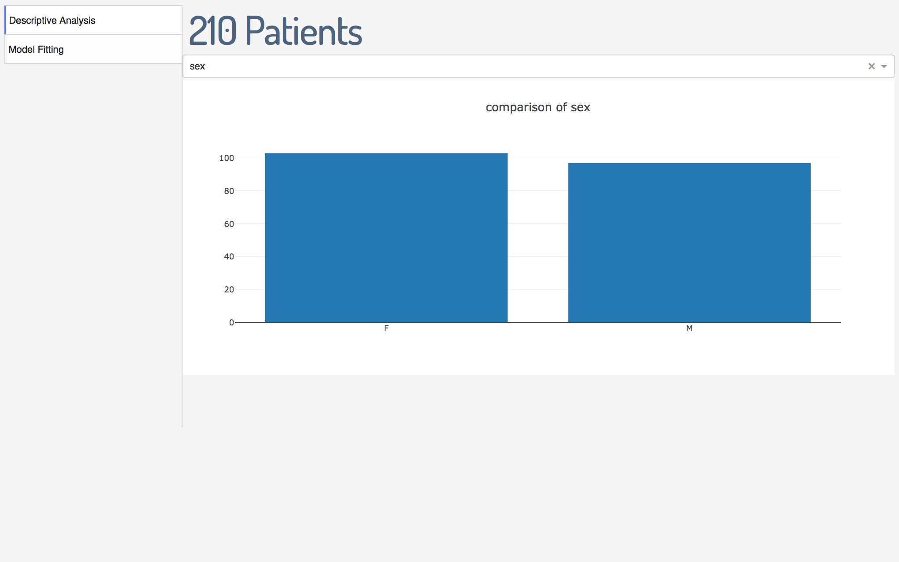
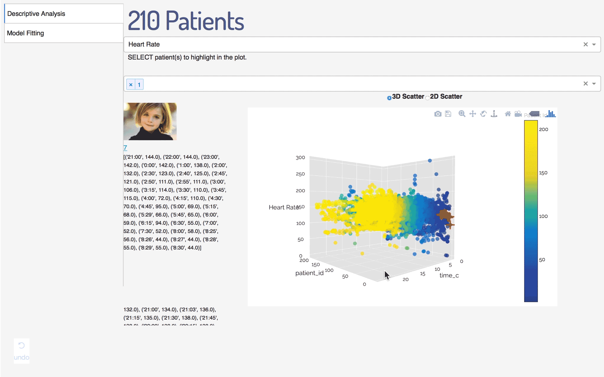
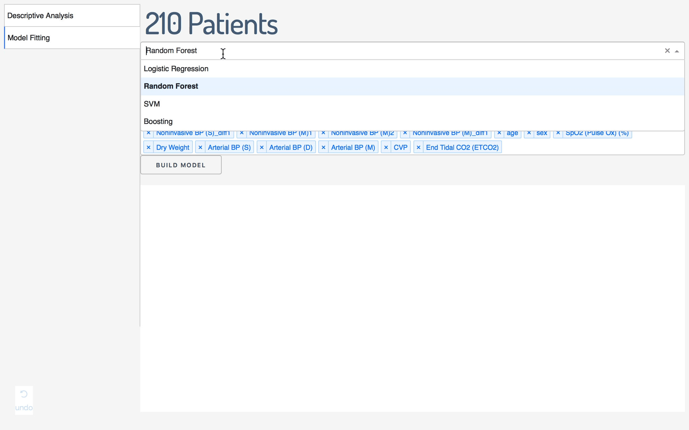
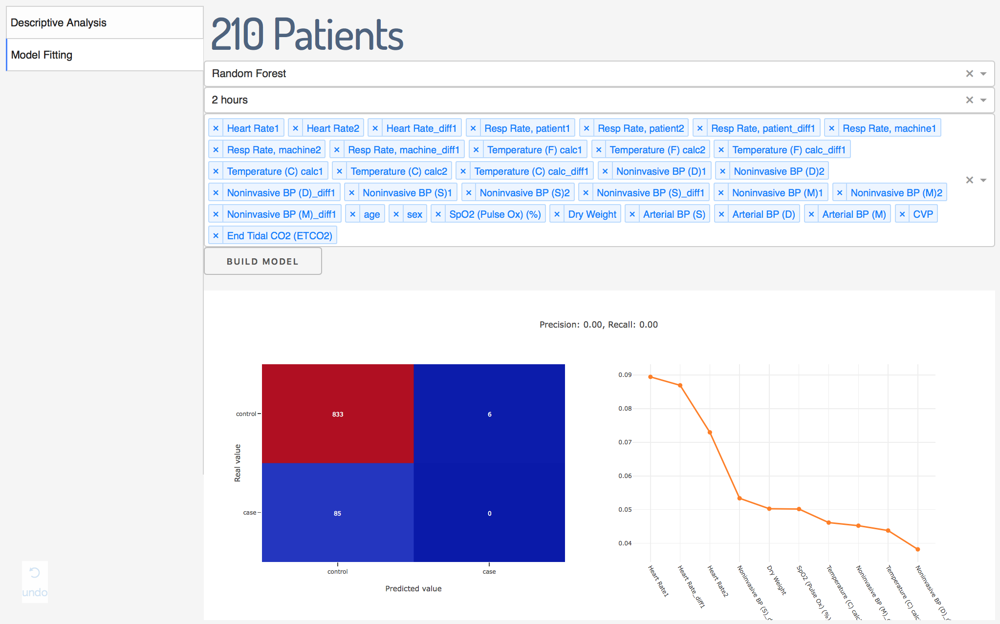

# A dashboard by Python Dash
This is a dashboard aiming at data visualization and machine learning model building

## Getting Started

## Functions
This project supportes the following two functions.
### Explorative Data Analysis
This will plot bar plot for categorical variables and scatter plot for continous variables.

* Bar plot for categorical variable:

* 3D scatter plot:

This demo is the plot of heart rate through time, and users can choose to hightlight some patients by red crosses.

### Machine Learning Model Building
Current program supports models from logistic regression, lienar SVM, random forest, and gradient boosting. 

It runs randomized search of parameters with all features, and it allows users to select features. The output is confusion matrix and variable importance plot (if the model has).

