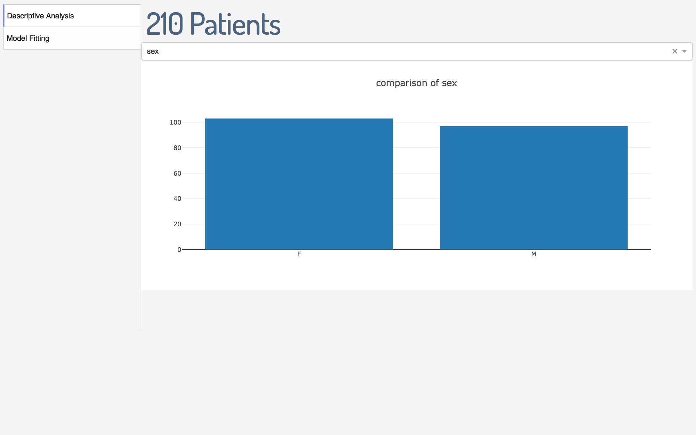
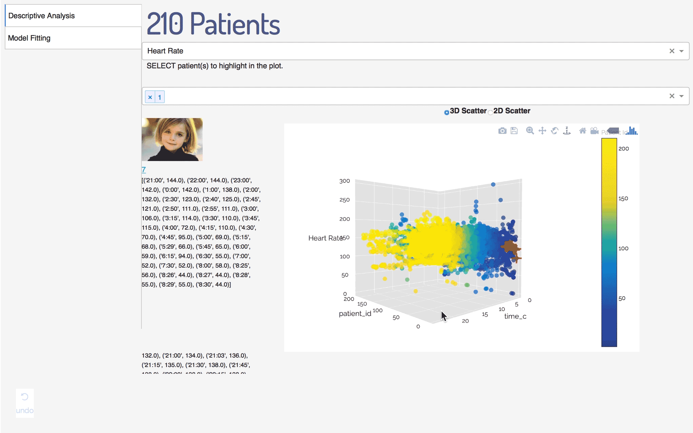
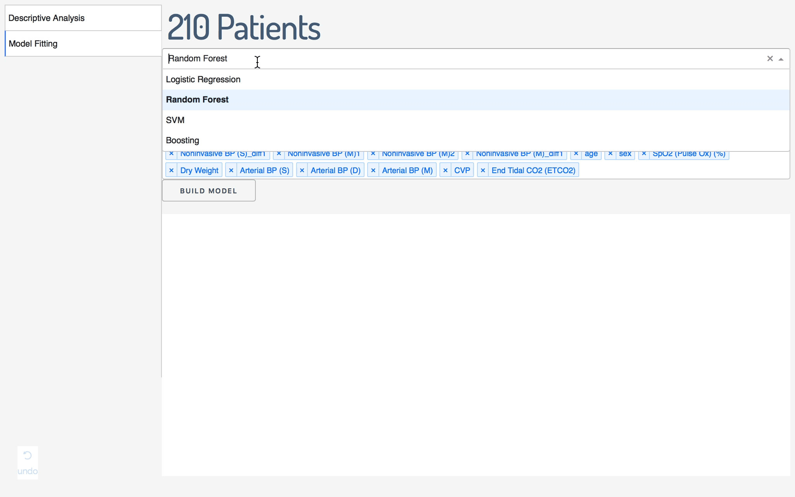
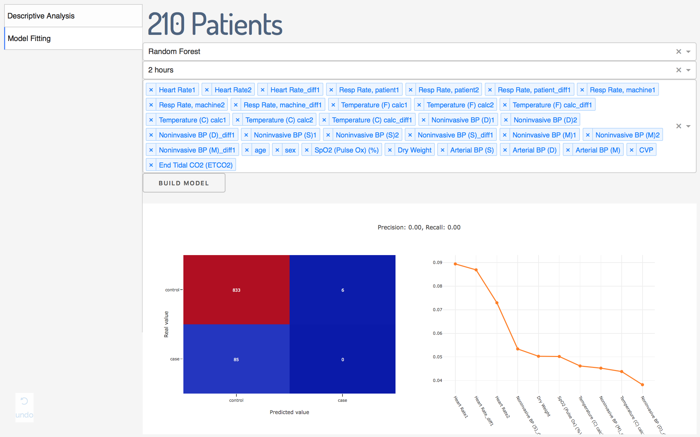

# A dashboard by Python Dash
This is a dashboard aiming at data visualization and machine learning model building

## Getting Started
* [Dash](https://plot.ly/products/dash/) - The home page of dash
* Installation
```
pip install dash==0.21.0  # The core dash backend
pip install dash-renderer==0.11.3  # The dash front-end
pip install dash-html-components==0.9.0  # HTML components
pip install dash-core-components==0.21.0  # Supercharged components
pip install plotly --upgrade  # Plotly graphing library used in examples
```

## Functions
This app supportes the following two functions.
### Explorative Data Analysis
This will plot bar plot for categorical variables and scatter plot for continous variables.

* Bar plot for categorical variable:


* 3D scatter plot:


This demo is the plot of heart rate through time, and users can choose to hightlight some patients by red crosses.

### Machine Learning Model Building
Current program supports models from logistic regression, lienar SVM, random forest, and gradient boosting. 


It runs randomized search of parameters with all features, and it allows users to select features. The output is confusion matrix and variable importance plot (if the model has one).


